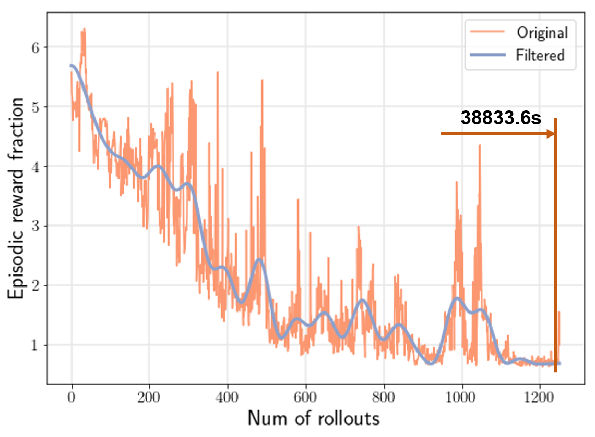
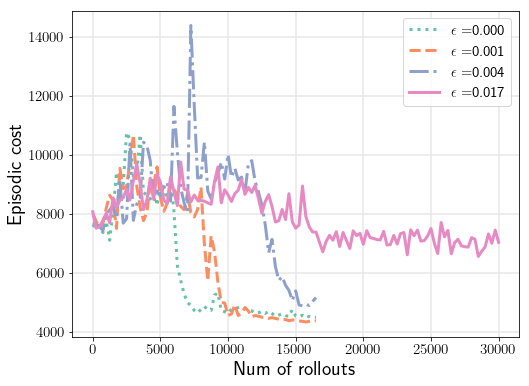
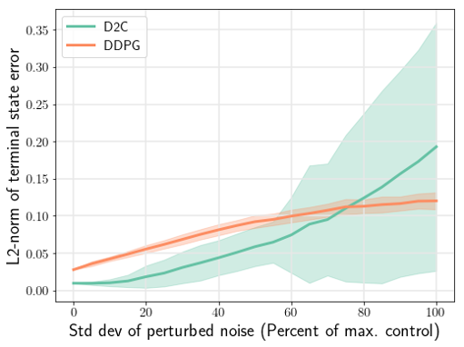

# ddpg_mujoco
ddpg training and testing code with libraries needed

------
The code in this project is modified based on https://github.com/karthikeyaparunandi/DDPG_D2C

## Environment Setup
1. OS: Windows10 Community

2. gym==0.10.9
   - after installation, replace the gym/gym folder with the gym folder inthis repository

3. keras==2.2.0

4. mujoco_py (mjpro150)
   - download mujoco150 from https://www.roboti.us/index.html, install and get a license
   - install mujoco_py from the .zip file in folder mujoco_py

5. tensorflow
   - cpu version: 1.10.0
   - gpu version: 1.8.0

6. keras-rl

## Run on CPU
Install the cpu version tensorflow.

## Run on GPU
- OS: Windows10 Community

- GPU: NVIDIA MX150

- CUDA: v9.1

- CUDNN: v7.1

- Tensorflow-GPU: 1.8.0

## Files
ddpg_workspace

- train_and_test
  - $(modelname).py: run this file to do ddpg training and testing, also change step number, process noise, OU process parameter, etc in this file.
  - common_func.py: call_back function and result data file modification function that adds key `process_noise_std` and `theta` for plot legends.
  - perfcheck.py: do Monte-Carlo runs to evaluate the trained policy for its robustness.

- results
  - stochasticity_perf_plot.py: plot the robustness evaluation results.
  - visualize_log.py: plot the training cost/cost fraction curve.
  - visualize_processnoise.py: plot training curve for multiple training runs under different noise parameters.
  - $(modelname) folders: training and testing data are saved here.

## Examples

## Troubleshooting & Logs
- The code is first used in the preparation for the D2C DDPG comparison paper and its supplementary file which are submitted to ICML2020.

- This tensorflow can work with numpy==1.16, however some issues may occur with numpy==1.14.